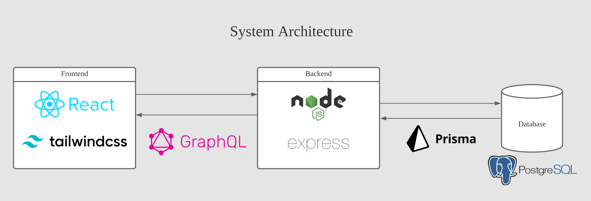

## React & Express app with GraphQL and Prisma

Classic MERN app with some modern twists, instead of REST API and ORM/SQL abstraction, GraphQL and Prisma are used.

## Blueplan

Take a look at the package.json(s) inside frontend and backend to see all the dependencies.
But I will highlight some crucial inclusions here.

| Frontend         |            |
|------------------|------------|
| frontend framework | react |
| CSS framework | tailwind |

| Backend          |            |
|------------------|------------|
| backend framework| node.js    |
| HTTP, routing    | express.js |
| database         | postgresql |
| API              | graphql    |
| ORM              | prisma     |
| authentication   | passport.js|
| GraphQL utils | graphql-tools, graphql-codegen |

</open>

## Technical Commentary

<ul>
    <li>
        Both backend and frontend are up and running. Well, for the first time, I witnessed first hand something that was working before broke due to software changes. Just to start start two apps took some time.
    </li>
    <li>
        Prisma schema. Initially I wanted to use MongoDB, but the integration of Prisma with MongoDB was terrible, and I switched to a traditional relational database PostgreSQL (by the way under the hood Prisma use SQL anyway). Besides, you can download a free local PostgreSQL with a great GUI pgAdmin.
    </li>
    <li>
        Migrated local PostgreSQL databse. Pretty similar to what Django do.
    </li>
</ul>

